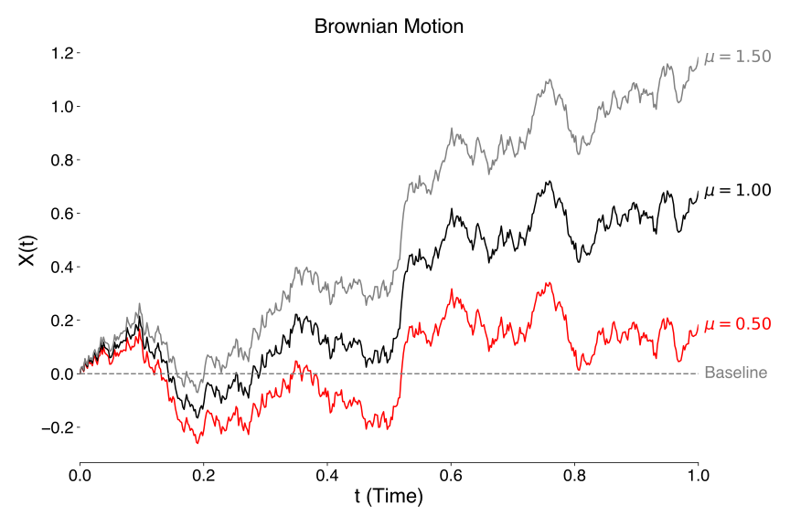

# notes_on_finance

* Welcome to my notes on finance, where, as a physicist, I try to make sense of concepts on economics and related topics. 

* Each topic will be organized into a jupyter notebook (ipynb), in which I define basic concepts and use python to understand and visualize them. 

## 00_brownian_motion.ipynb

* Introduction to the basic concept of Brownian motion and standard Brownian motion. 

* Understanding of concepts such as drift and diffusion. 

